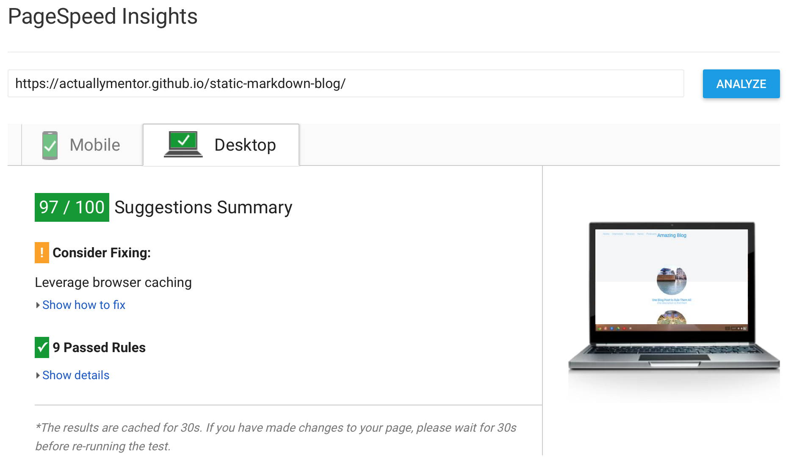

# Static Markdown Blog [](https://travis-ci.org/actuallymentor/static-markdown-blog)


To replace my old WordPress blog I'm making a system to compile markdown files to static blog files.

I considered systems like hexa.io but find them too complex for my needs.

## Live demo

[Live link on Github Pages]( https://actuallymentor.github.io/static-markdown-blog/ )


## Getting started

Clone this repository:

```shell
git clone https://github.com/actuallymentor/static-markdown-blog.git
```

Terminal commands:

```shell
npm run new # Create an .md for a new post
npm run build # Build the blog files for production
npm run preview # Build your blog and preview in the browser ( localhost:3000 )
npm start # Start dev server  which watches the css and js files
skip=true npm start # As aboveut don't re-compress all images ( slow )
npm test # Do basic system chacks and check all your links ( hrefs, external dependencies, etc )
```

## Basic usage

1. npm run new
2. Open NEWPOST.md
3. Write post ( optional assets in content/assets/ )
4. npm run build
5. Upload public/* to your webserver

Note that the post url slug is based on the file name.

File: i-am-am-post.md

With config:

```json
{
    "title": "One Blog Post to Rule Them All",
    "desc": "One description to find them",
    "categories": [ "news", "reviews", "interviews" ],
    "type": "post",
    "template": "blog",
    "published": "2016-12-20",
    "updated": "",
    "featuredimg": "assets/large-image.jpg"
}
```

Would result in:

- yourblog.url/post/i-am-am-post.html
- yourblog.url/news/i-am-am-post.html
- yourblog.url/reviews/i-am-am-post.html
- yourblog.url/interviews/i-am-am-post.html

`"type": "post"` can be post, podcast or page

`"template": "blog"` refers to the pug template

### Posts vs pages

Content with the type 'page' will not appear in the RSS feed (it will in the sitemap). Posts will be published to categories and the index page. Both types appear in the search page.

### Search page

The `search.html` page allows a browser-side search of the blog content. Note that this search loads a stripped .json file containing titles and descriptions of your posts, pages and podcasts.

This shifts the computational load of searching to the client browser rather than a backend server. It does however mean the search page depends on more bandwidth (for the search json file). I don't think this will be an issue as every post takes about 200 bytes of data. This means that even 10,000 posts will result in a file of ~2MB, which is less than a medium sized image.

## About the system

### Functionality

This system does some basic things:

- Combine .md and .pug files into .html files
- Compress & resize all .png and .jpg images ( output: .jpg )
- Output a sitemap ( & podcast map )

For podcasting simply in your .md file specify the category 'podcast' and add relevant details so that it matches:

```json
{
    "title": "I am a podcast",
    "desc": "One description to find them",
    "categories": [ "podcasts", "reviews", "interviews" ],
    "published": "2016-12-29",
    "updated": "",
    "featuredimg": "assets/large-image.jpg",
    "duration": "20:00",
    "audio": "/assets/podcast/episode.mp3"
}
```

### About SEO

The default theme includes social graph support.

| Type | Support | Location |
| ---- | ------- | -------- |
| Facebook Open Graph | Yes | ` <head> `
| Twitter cards | Yes | ` <head> `
| Google Rich Data Snippets | Yes | ` <script> under <footer> `

The yourblog.url/category/post.html links are `rel="calonical" to the yourblog.url/posts/post.html` to prevent duplicate content.

### Page Speed Score

The setup is very advantageous for page speed. Note how the only impediment to a 100% score is the fact that Github Pages does not leverage browser caching.



### Understanding structure

| Path | Function |
| ------ | -------- |
| content | Holds your markdown files and their meta files
| content/assets | Holds your static resources like images
| system | Holds the files that compile the markdown to html
| system/modules/config.js | Holds the blog configurations like page title and blog author
| system/templates | Holds the pug templates for the blog pages
| system/theme | Holds the css and js files for your theme
| public | This is where the compiled static blog files end up

Important things to know:

- In the .md files you can reference the assets folder locally as ./assets, this will be changed to yourblog.url/assets in the compiled blog version
- Images with id="feat" are compressed to featured image size (see config)
- Images in posts are resized to post image size (see config)
- Images with class="thumb" are compressed to thumbnail size

### Editing themes

The pug files in the system/templates folder supply the markup structure. The styling and js comes from the theme/ folder.